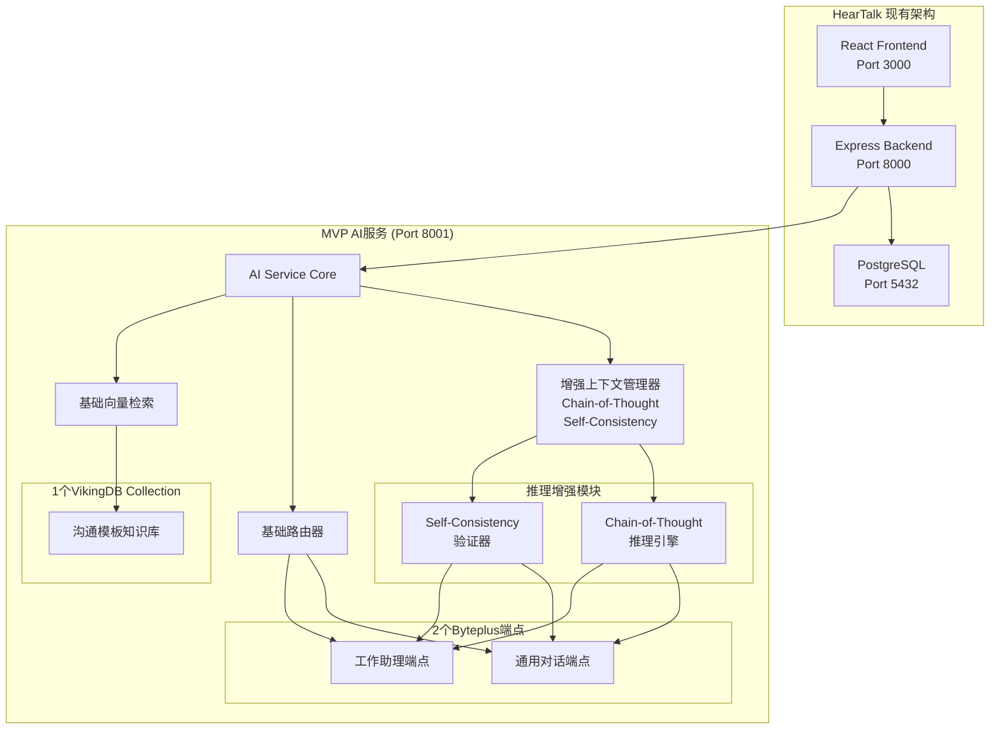

# PRD: HearTalk AI服务MVP替换项目

## Executive Summary

开发一个简化版AI微服务来替换现有HearTalk项目的AI服务模块，实现100%API兼容的同时，集成基础的Byteplus端点和VikingDB向量数据库能力。MVP版本专注于核心功能，确保快速上线并验证技术架构的可行性。

### 核心价值主张
- **快速上线**: 6周开发周期，比完整版本减少54%时间
- **零风险替换**: 100%API兼容，无需修改现有系统
- **基础增强**: 集成基本的智能路由和上下文管理
- **渐进式架构**: 为后续功能扩展打下基础

## Problem Statement

### MVP聚焦的核心问题
1. **API兼容性验证**: 确保新服务能够完全替换现有AI服务
2. **基础性能提升**: 通过端点优化提供更稳定的服务
3. **简单上下文管理**: 实现会话内的对话连续性
4. **技术架构验证**: 验证Byteplus和VikingDB集成的可行性

### 为什么选择MVP方式？
- 降低技术风险，快速验证核心假设
- 减少开发成本和时间投入
- 获得早期用户反馈，指导后续迭代
- 建立基础架构，为完整版本铺路

## User Stories

### 主要用户角色
1. **HearTalk现有用户**: 继续使用熟悉的对话界面，体验更稳定的AI服务
2. **系统管理员**: 无缝替换AI服务，无需额外运维成本
3. **开发团队**: 验证新技术栈，为后续功能开发积累经验

### 核心用户体验
**作为HearTalk用户，我希望:**
- 继续使用现有的对话功能，无需学习新操作
- 对话能记住前面说过的内容（会话内上下文）
- AI回答更加稳定，减少超时和错误
- 获得基本的智能回答和模板建议

**验收标准:**
- 所有现有API功能正常工作 100%
- 会话内上下文记忆长度 > 10轮对话
- 服务响应时间 < 5秒（95%的请求）
- 系统可用性 > 99%

## Requirements

### Functional Requirements

#### 核心API兼容性
**FR-1: 完整API兼容** `[P0 - 必需]`
- 实现现有HearTalk AI服务的所有API端点
- 保持相同的请求/响应格式
- 维持相同的认证和错误处理机制

**具体端点（与完整版相同）:**
- `POST /api/v1/chat/generate`
- `POST /api/v1/chat/stream`
- `POST /api/v1/translate`
- `GET /api/v1/health`
- `GET /api/v1/providers`
- `GET /api/v1/models`

#### 基础Byteplus集成
**FR-2: 简化端点路由** `[P0 - 必需]`
- 集成2个核心Byteplus端点（简化版）
  - `BYTEPLUS_AMI_CHAT_EP`: 通用对话端点
  - `BYTEPLUS_AMI_WORK_ASSISTANT_EP`: 工作助理端点
- 实现关键词路由算法（非智能路由）
- 支持基础的故障切换

**路由逻辑（简化）:**
```javascript
// 简单关键词匹配
if (query.includes('工作') || query.includes('任务') || query.includes('项目')) {
  return 'BYTEPLUS_AMI_WORK_ASSISTANT_EP';
} else {
  return 'BYTEPLUS_AMI_CHAT_EP';
}
```

#### 基础Vector Database集成
**FR-3: 单Collection集成** `[P0 - 必需]`
- 集成VikingDB的1个Collection
  - `communication_templates_base`: 基础沟通模板库
- 实现基础RAG功能（无复杂语义匹配）
- 支持简单的向量搜索和相关度匹配

#### 增强上下文管理和推理
**FR-4: 会话内上下文与推理增强** `[P0 - 必需]`
- 实现第一层上下文管理：同一conversation_id内的对话历史
- 基础的对话记录压缩（文本截断，非AI精炼）
- 支持最多10轮对话的上下文记忆
- **集成Chain-of-Thought推理机制**
- **实现Self-Consistency验证技术**
- 增强的上下文理解、关联和引用能力

**推理技术实现:**
```javascript
class EnhancedContextManager {
  async getConversationContext(conversationId, maxTokens = 2000) {
    const messages = await this.getRecentMessages(conversationId, 10);
    return this.truncateToTokenLimit(messages, maxTokens);
  }
  
  // Chain-of-Thought推理增强
  async buildReasoningContext(conversationId, query) {
    const context = await this.getConversationContext(conversationId);
    
    // 构建CoT推理prompt
    const cotPrompt = this.buildChainOfThoughtPrompt(context, query);
    
    // Self-Consistency验证（在资源允许时）
    if (this.shouldUseSelfConsistency(query)) {
      return await this.applySelfConsistency(cotPrompt, query);
    }
    
    return cotPrompt;
  }
  
  // 构建思维链推理prompt
  buildChainOfThoughtPrompt(context, query) {
    return `
基于以下对话历史，请逐步分析用户的问题：

对话历史：
${context}

当前问题：${query}

请按以下步骤思考：
1. 理解问题：用户在询问什么？
2. 分析上下文：从对话历史中找到相关信息
3. 建立关联：将当前问题与历史信息联系起来
4. 推理过程：逐步分析和推理
5. 得出结论：基于分析给出回答

让我逐步思考：
`;
  }
  
  // Self-Consistency实现
  async applySelfConsistency(prompt, query, samples = 3) {
    const responses = [];
    
    // 生成多个推理路径
    for (let i = 0; i < samples; i++) {
      const response = await this.generateWithCoT(prompt);
      responses.push(response);
    }
    
    // 分析一致性并选择最佳答案
    return this.selectMostConsistentResponse(responses, query);
  }
}
```

### Non-Functional Requirements

#### 性能要求（放宽版）
**NFR-1: 基础性能**
- API响应时间 < 5秒（95%的请求）
- 并发处理能力 > 50 req/s
- Vector搜索响应时间 < 500ms

#### 可用性要求
**NFR-2: 基础可用性**
- 系统可用性 > 99%
- 支持基础故障切换
- 实现健康检查和监控

## Technical Architecture

### MVP核心组件

#### 1. 增强上下文管理器
```javascript
class EnhancedContextManager {
  // 基础会话上下文
  async getConversationContext(conversationId, maxTokens = 2000)
  
  // Chain-of-Thought推理增强
  async buildReasoningContext(conversationId, query)
  
  // 构建思维链推理prompt
  buildChainOfThoughtPrompt(context, query)
  
  // Self-Consistency验证（条件性使用）
  async applySelfConsistency(prompt, query, samples = 3)
  
  // 智能决策是否使用Self-Consistency
  shouldUseSelfConsistency(query) {
    // 复杂推理问题、关键决策问题使用
    const complexPatterns = ['分析', '比较', '原因', '为什么', '如何', '步骤'];
    return complexPatterns.some(pattern => query.includes(pattern));
  }
}
```

#### 2. 关键词路由器
```javascript
class BasicRouter {
  // 关键词匹配路由
  async selectEndpoint(query) {
    const workKeywords = ['工作', '任务', '项目', '计划', '安排'];
    const hasWorkKeyword = workKeywords.some(keyword => 
      query.includes(keyword)
    );
    return hasWorkKeyword ? 'WORK_ASSISTANT' : 'GENERAL_CHAT';
  }
}
```

#### 3. 基础向量检索
```javascript
class BasicVectorRetrieval {
  // 单Collection检索
  async searchTemplates(query, limit = 3) {
    return await this.vikingDB.search({
      collection: 'communication_templates_base',
      query: query,
      limit: limit
    });
  }
}
```

### 增强推理的系统架构


## Implementation Strategy

### MVP开发阶段（6周总计）

#### Phase 1: 基础架构搭建 (1.5周)
- 创建AI服务项目结构
- 实现基础Provider Factory模式
- 集成2个Byteplus端点配置
- 搭建开发和测试环境

#### Phase 2: API兼容性实现 (2周)
- 实现所有现有API端点
- 确保请求/响应格式完全兼容
- 集成认证和中间件系统
- 完成基础功能测试

#### Phase 3: 基础Vector集成 (1周)
- 集成VikingDB单个Collection
- 实现基础RAG检索功能
- 简单向量搜索性能测试
- 完成模板检索功能测试

#### Phase 4: 简化上下文和路由 (1周)
- 实现关键词路由算法
- 开发会话内上下文管理
- 集成基础缓存机制
- 完成端到端功能测试

#### Phase 5: 测试和部署 (0.5周)
- 完成兼容性验证测试
- 进行基础性能测试
- 执行生产环境部署
- 监控系统运行状态

## Success Criteria

### MVP成功指标

#### 兼容性指标（必须达标）
- **API兼容率**: 100% - 所有现有API端点正常工作
- **零修改替换**: 0个文件修改 - HearTalk其他模块无需修改
- **功能对等**: 100% - 现有基础功能完全保持

#### 基础性能指标
- **响应时间**: 平均响应时间 < 5秒
- **并发处理**: 支持并发请求数 > 50 req/s
- **系统可用性**: > 99%
- **错误率**: < 1%

#### 用户体验指标
- **上下文连续性**: 支持10轮对话记忆
- **模板匹配**: 基础模板检索成功率 > 80%
- **端点路由**: 关键词路由准确率 > 70%

#### 推理质量指标 (新增)
- **Chain-of-Thought推理**: 复杂问题逻辑推理准确率 > 85%
- **Self-Consistency验证**: 关键决策问题一致性 > 90%
- **上下文关联理解**: 历史信息关联准确度 > 88%
- **推理透明度**: 推理过程可解释性评分 > 8.0/10

## Constraints & Assumptions

### MVP特定约束
- **功能范围限制**: 仅实现核心功能，避免过度工程化
- **性能要求放宽**: 重点关注稳定性而非极致性能
- **单一Collection**: 仅使用1个VikingDB Collection降低复杂度

### 技术约束
- **API兼容性**: 必须保持100%兼容
- **开发时间**: 严格控制在6周内
- **资源配置**: 使用现有的Byteplus和VikingDB配置

## Out of Scope (留待后续版本)

### MVP明确不包含
- **多层上下文架构**: 跨会话和全局上下文留待v2.0
- **智能路由算法**: 复杂的AI路由留待v2.0
- **Web搜索集成**: 实时搜索功能留待v2.0
- **Claude Code PM专业能力**: 专业化功能留待v2.0
- **多模态输入**: 图像、语音等输入留待v3.0

### 后续版本规划
- **v2.0**: 智能路由 + 多层上下文 + Web搜索
- **v3.0**: Claude Code专业能力 + 多模态输入
- **v4.0**: 高级分析 + 第三方集成

## Cost-Benefit Analysis

### MVP成本预估
- **开发成本**: ¥75,000（6周开发）
- **月度运营**: ¥20,000（与现有基本持平）
- **总投资**: ¥75,000 + ¥20,000/月

### 预期收益
- **风险降低**: 快速验证技术可行性
- **时间节省**: 比完整版本节省7周开发时间
- **稳定性提升**: 基础的端点优化和故障切换
- **架构验证**: 为后续完整版本打下基础

### ROI预期
- **主要价值**: 风险控制和技术验证
- **次要价值**: 基础性能提升和用户体验改善
- **长期价值**: 为完整版本积累经验和用户反馈

## Risk Assessment

### 降低的风险（相比完整版）
- **技术复杂度风险**: 从高风险降至中风险
- **开发进度风险**: 从中风险降至低风险
- **集成复杂度风险**: 从高风险降至低风险

### 仍需关注的风险
- **API兼容性风险**: 中风险 - 需要严格测试
- **性能满足度风险**: 低风险 - 要求已放宽
- **用户接受度风险**: 低风险 - 功能基本对等

## Next Steps

1. **批准MVP PRD**: 确认简化需求和6周开发计划
2. **创建MVP Epic**: 运行 `pm:prd-parse ai-service` 创建实施计划
3. **环境准备**: 确认开发环境和Byteplus/VikingDB配置
4. **团队组建**: 分配1名全栈开发工程师
5. **开始开发**: 按照6周计划开始Phase 1开发

---

**MVP项目预期交付**: 6周  
**预期投入资源**: 1名全栈开发工程师  
**预期收益**: 技术架构验证 + API兼容性确认 + 基础性能提升