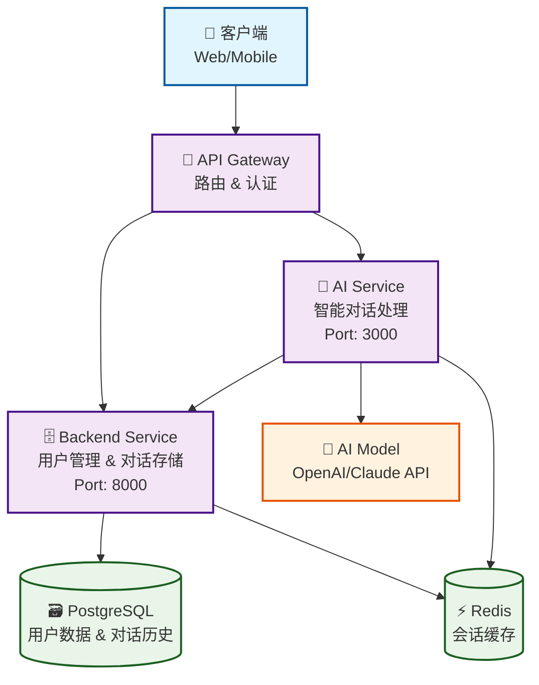
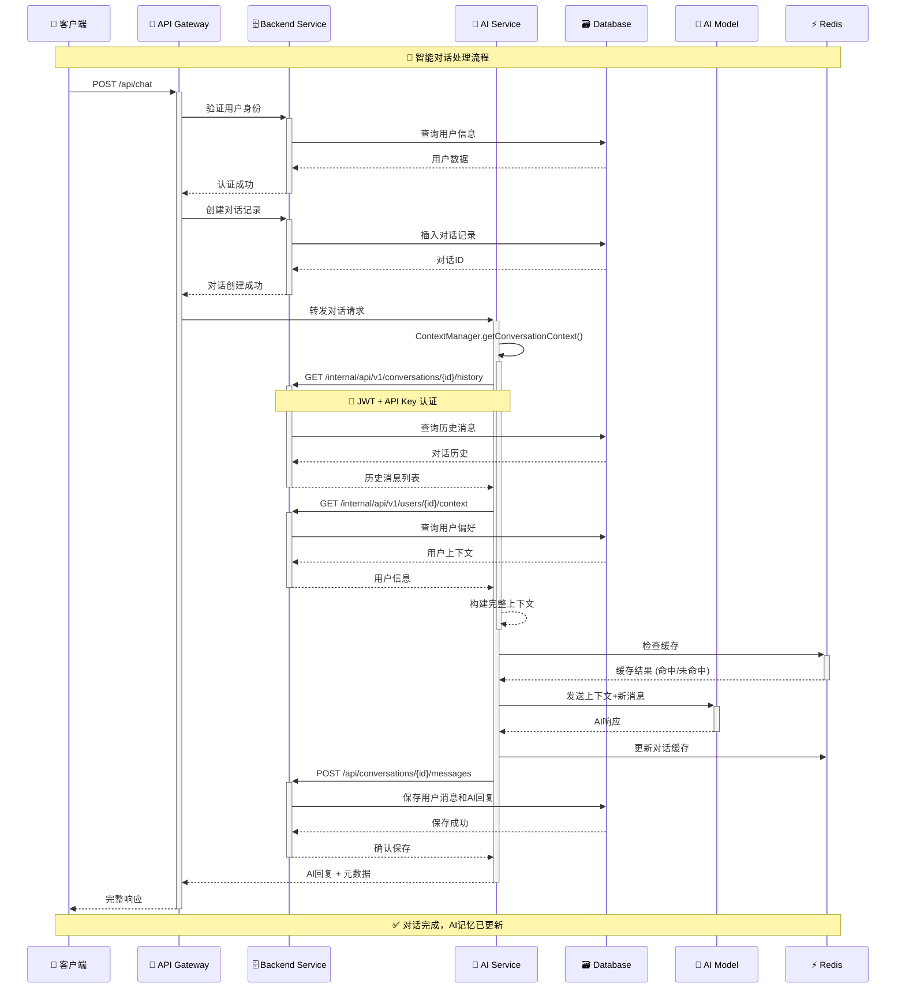
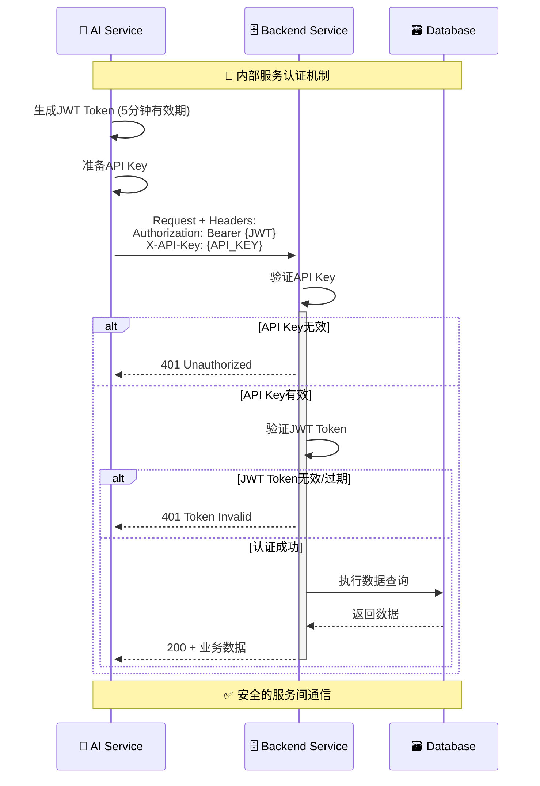
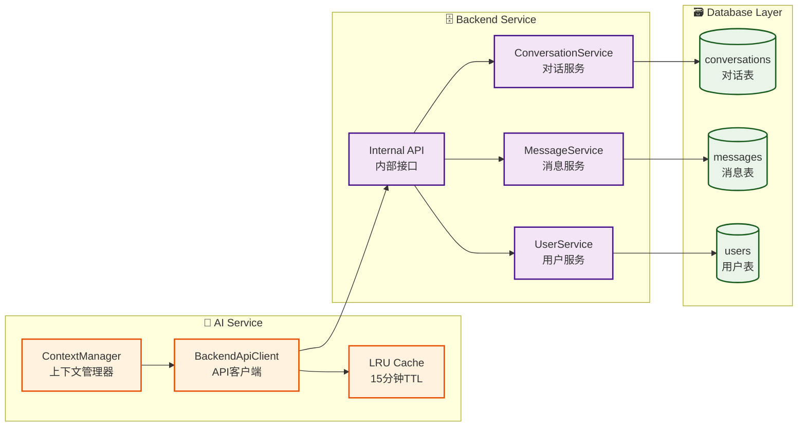
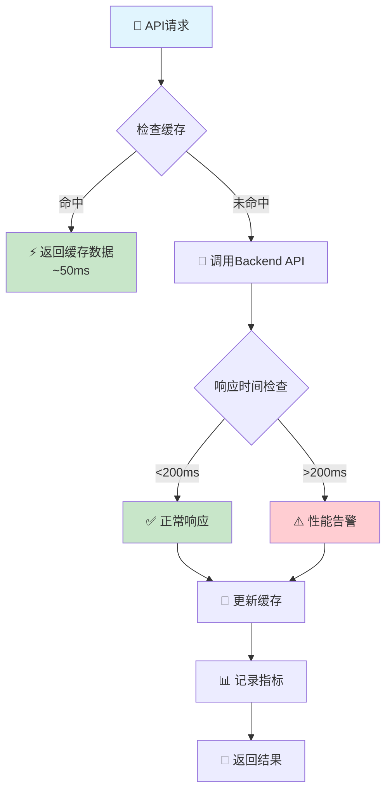

# HearTalk AI - 智能对话平台

[](https://opensource.org/licenses/MIT)
[](https://nodejs.org/)
[](https://github.com/hedwig-44/HEARTALK-AI/issues)

> 一个现代化的AI对话平台，支持智能记忆、多轮对话和个性化体验

## 📖 项目简介

HearTalk AI是一个综合性的AI对话平台，旨在提供自然、智能、有记忆的对话体验。通过先进的AI技术和完善的后端架构，为用户打造个性化的AI助手服务。

### 🎯 核心特性

- **🧠 智能记忆系统**: AI能够记住对话历史，提供连贯的多轮对话体验
- **👤 个性化体验**: 基于用户偏好和历史对话定制响应风格
- **🔐 安全认证**: JWT + API Key双重认证机制保障数据安全
- **⚡ 高性能**: API响应时间优化到200ms以内，支持并发访问
- **🔧 模块化架构**: 前端、后端、AI服务分离，便于扩展和维护
- **📊 智能分析**: 对话质量分析和用户行为洞察

## 🏗️ 系统架构

### 微服务架构图 (v1.0)



### 目录结构

```
HearTalk AI Platform
├── frontend/              # 前端应用
│   ├── web/              # Web界面 (React/Vue)
│   └── mobile/           # 移动端应用
├── backend/              # 后端服务
│   ├── src/
│   │   ├── routes/       # API路由
│   │   ├── services/     # 业务逻辑
│   │   ├── middleware/   # 中间件
│   │   └── utils/        # 工具函数
│   └── scripts/          # 部署和维护脚本
├── ai-service/           # AI服务
│   ├── src/
│   │   ├── controllers/  # AI控制器
│   │   ├── services/     # AI服务逻辑
│   │   └── utils/        # AI工具类
│   └── models/           # AI模型配置
└── docs/                 # 项目文档
```

## 🔄 API调用流程

### Chat API 调用流程图



### Internal API 认证流程



### AI记忆系统架构



### 性能优化流程



### 核心技术栈

| 组件 | 技术选型 | 版本 | 说明 |
|------|---------|------|------|
| **Backend Service** | Node.js + Express.js | 16+ | RESTful API服务 |
| **AI Service** | Node.js + Express.js | 16+ | AI对话处理引擎 |
| **数据库** | PostgreSQL | 13+ | 主数据存储 |
| **缓存** | Redis | 6+ | 会话和性能缓存 |
| **AI模型** | OpenAI API / Claude API | Latest | 大语言模型接口 |
| **认证** | JWT + API Key | - | 双重安全认证 |
| **日志** | Winston | 3+ | 结构化日志记录 |
| **测试** | Jest | 29+ | 单元和集成测试 |
| **容器化** | Docker + Docker Compose | Latest | 服务编排和部署 |

## 🚀 快速开始

### 环境要求

- Node.js 16+
- Docker & Docker Compose
- PostgreSQL 13+
- Redis 6+

### 安装步骤

1. **克隆项目**
   ```bash
   git clone https://github.com/hedwig-44/HEARTALK-AI.git
   cd HEARTALK-AI
   ```

2. **环境配置**
   ```bash
   # 后端环境配置
   cd backend
   cp .env.example .env
   # 编辑 .env 文件，配置数据库和API密钥
   
   # AI服务环境配置
   cd ../ai-service
   cp .env.example .env
   # 配置AI模型和Backend API连接信息
   ```

3. **安装依赖**
   ```bash
   # 后端依赖
   cd backend && npm install
   
   # AI服务依赖
   cd ../ai-service && npm install
   ```

4. **启动服务**
   ```bash
   # 使用Docker Compose启动所有服务
   docker-compose up -d
   
   # 或者分别启动各个服务
   cd backend && npm start
   cd ai-service && npm start
   ```

5. **验证部署**
   ```bash
   # 检查后端健康状态
   curl http://localhost:8000/health
   
   # 检查AI服务状态
   curl http://localhost:3000/health
   ```

## 🔧 API文档

### Backend API

#### 用户相关
- `POST /api/auth/login` - 用户登录
- `POST /api/auth/register` - 用户注册
- `GET /api/users/profile` - 获取用户信息

#### 对话相关
- `POST /api/conversations` - 创建新对话
- `GET /api/conversations/:id` - 获取对话详情
- `POST /api/conversations/:id/messages` - 发送消息

#### Internal API (AI服务专用)
- `GET /internal/api/v1/conversations/:id/history` - 获取对话历史
- `GET /internal/api/v1/users/:id/context` - 获取用户上下文
- `GET /internal/api/v1/health` - 健康检查

### AI Service API

#### 对话处理
- `POST /api/chat` - 处理对话请求
- `GET /api/chat/:id/status` - 获取对话状态
- `POST /api/chat/feedback` - 提交反馈

## 🧪 测试

### 运行测试套件

```bash
# 后端测试
cd backend && npm test

# AI服务测试
cd ai-service && npm test

# 集成测试
npm run test:integration
```

### 性能测试

```bash
# API性能测试
npm run test:performance

# 压力测试
npm run test:stress
```

## 🔒 安全特性

- **双重认证**: JWT令牌 + API密钥验证
- **数据加密**: 敏感数据传输和存储加密
- **访问控制**: 基于角色的权限管理
- **审计日志**: 完整的操作日志记录
- **安全头**: CORS、CSRF保护

## 📊 监控和日志

### 日志系统
- 结构化日志记录 (Winston)
- 多级别日志输出
- 日志轮转和归档
- ELK Stack集成支持

### 性能监控
- API响应时间监控
- 系统资源使用情况
- 用户行为分析
- 错误率和可用性监控

## 🛠️ 开发指南

### 代码规范
- ESLint + Prettier代码格式化
- 统一的命名约定
- 完善的错误处理
- 单元测试覆盖率 > 80%

### 提交规范
```
feat: 新功能
fix: 修复bug
docs: 文档更新
style: 代码格式调整
refactor: 代码重构
test: 测试相关
chore: 构建或工具更改
```

### 分支策略
- `main`: 生产环境代码
- `develop`: 开发环境代码
- `feature/*`: 功能开发分支
- `hotfix/*`: 紧急修复分支

## 📈 路线图

### v1.0 (当前版本)
- [x] 基础对话功能
- [x] 用户管理系统
- [x] AI记忆系统
- [x] Internal API集成

### v1.1 (计划中)
- [ ] 多语言支持
- [ ] 语音对话功能
- [ ] 高级个性化设置
- [ ] 对话导出功能

### v2.0 (未来版本)
- [ ] 多模态AI支持
- [ ] 实时协作功能
- [ ] 插件系统
- [ ] 移动端应用

## 🤝 贡献指南

我们欢迎社区贡献！请查看 [CONTRIBUTING.md](CONTRIBUTING.md) 了解详细的贡献指南。

### 报告问题
在提交Issue之前，请：
1. 检查是否已有相似问题
2. 提供详细的复现步骤
3. 包含环境信息和错误日志

### 提交代码
1. Fork项目到个人仓库
2. 创建功能分支
3. 提交代码并编写测试
4. 创建Pull Request

## 📄 许可证

本项目采用 [MIT License](LICENSE) 开源协议。

## 🙏 致谢

感谢以下开源项目和贡献者：
- [Express.js](https://expressjs.com/) - Web框架
- [Winston](https://github.com/winstonjs/winston) - 日志系统
- [Jest](https://jestjs.io/) - 测试框架
- [Docker](https://www.docker.com/) - 容器化部署

## 📞 联系我们

- 项目地址: https://github.com/hedwig-44/HEARTALK-AI
- 问题反馈: https://github.com/hedwig-44/HEARTALK-AI/issues
- 邮箱: support@heartalk.dev

---

<p align="center">
  Made with ❤️ by HearTalk Team
</p>